# Lab: Build a Canvas Power App with a Dataverse Table and a Power Automate Flow

**Duration:** ~30 minutes
**Level:** Beginner
**Product area:** Microsoft Power Platform (Power Apps, Dataverse, Power Automate)

## Scenario

You work for **Contoso**, and the facilities team needs a quick way to log
maintenance requests. In this lab you will:

1. Create a custom **Dataverse** table to store requests.
2. Build a **Canvas Power App** to add and view requests.
3. Create a **Power Automate cloud flow** and call it from the app to send a
   confirmation notification.

---

## Part 1 — Create the Dataverse table (~7 min)

1. Go to **https://make.powerapps.com** and confirm your environment
   (top-right environment picker).
2. In the left nav, select **Tables** → **+ New table** →
   **Table (advanced properties)** (this opens the properties panel where you can
   set the display name).

   

3. In the properties panel enter:
   - **Display name:** `Maintenance Request`
   - Plural name auto-fills to `Maintenance Requests`.
4. Select **Save**. Dataverse creates the table with a primary column
   **Name** (rename its display name to `Title` via the column settings if you like).
5. Select the **+** next to the columns list to open the **New column** panel.

   

6. Add these columns by defining **Display name**, **Data type**, and **Format**.

   | Display name  | Data type            | Notes                                            |
   |---------------|----------------------|--------------------------------------------------|
   | `Description` | Multiline text       | Details of the issue                             |
   | `Location`    | Single line of text  | Building / room                                  |
   | `Priority`    | Choice               | Choices: `Low`, `Medium`, `High`                 |
   | `Status`      | Choice               | Choices: `New`, `In Progress`, `Done` (default `New`) |
   | `Requestor Email` | Single line of text (Email format) | Who logged it                       |

   > [!CAUTION]
   > **Choice columns:** For `Priority` and `Status`, when the **New column**
   > panel asks **Sync with global choice?**, set it to **No** so you create a
   > local choice with your own options for this table.

   

7. Your table should now look like this. *(Optional)* Add a couple of sample rows
   via **Edit** → **+ New row**.

   

✅ **Checkpoint:** You have a `Maintenance Request` table with custom columns.

---

## Part 2 — Create the Power Automate cloud flow (~8 min)

You'll build the flow first so the app can call it.

1. Go to **https://make.powerautomate.com** (same environment).
2. Select **Create** → **Instant cloud flow**.

   

3. Name it `Notify Maintenance Request`, choose **When Power Apps calls a flow
   (V2)** and then click **Create**.

   

4. On the **PowerApps (V2)** trigger, select **+ Add an input**:
   - Add a **Text** input named `RequestTitle`.
   - Add a **Text** input named `RequestorEmail`.
   - Add a **Text** input named `Priority`.

   

5. Select **+ New action**.

   

6. Search for send an email and select **Office 365 Outlook** > **Send an email
   (V2)** action.

   

7. Select **Sign in** to create the connection.

   

8. Configure **Send an email (V2)** action like below:
   - Rename the action as `SendEmail`.

     
   - Enable Dynamic content for the **To** field.

     
   - **To:** click lightning icon and select `RequestorEmail`.

     
   - **Subject:** `Request received: ` then insert dynamic content `RequestTitle`.

     
   - **Body:** Copy following text to it and use the **Dynamic content** picker
     to insert **RequestTitle** and **Priority** instead of typing the tokens.
     ```
     Your maintenance request "@{triggerBody()['text']}" was logged.
     Priority: (insert Priority dynamic content)
     We'll follow up shortly. — Contoso Facilities
     ```

     
9. Add **+ New step** → **Respond to a PowerApp or flow**.

   
10. Add output (Text) with name `Result`, then click the value field and select
    expression.

    
11. Type or copy-paste this expression to the field and click **Add**:

    ```
    actions('SendEmail').status
    ```

    
12. **Save** the flow.

   

✅ **Checkpoint:** A flow named `Notify Maintenance Request` accepts 3 inputs and
sends an email.

---

## Part 3 — Build the Canvas app (responsive) (~10 min)

1. Back in **https://make.powerapps.com/**, select **+ Create** → **Create from
   blank**.

   
2. Select **Responsive**.

   

3. Click **+** in header area and select **Text label**.

   
4. Configure control in properties pane like below:
   - Text: `Maintenance Request`
   - Font: 24
   - Text alignment: Center
   - Auto height: On
   - Flexible width: On

   
5. Select **MainContainer1** from the tree view and change its
   **Direction → Horizontal**.

   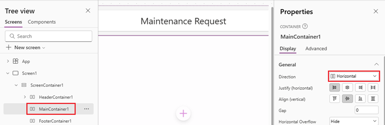
6. **Connect the data:** left rail **Data** → **+ Add data** → search/select
   `Maintenance Request`.

   

7. Click **+** in the main area (main container) and add **Vertical gallery** control.

   
8. Click **Data** and select **Maintenance Requests**.

   
9. Click **Layout** and select **Title, subtitle and body**.

   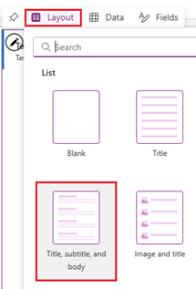
10. Select Fields and map **Subtitle** and **Body** fields:
    - Subtitle → `ThisItem.Location`
    - Body → `ThisItem.Priority`

    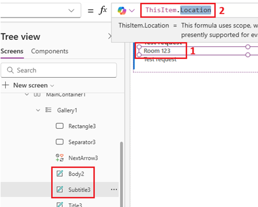
11. For responsiveness, avoid using fixed width and height. Set these properties:
    - Align in container: **Stretch**
    - Width: `Parent.Width * 0.5`

    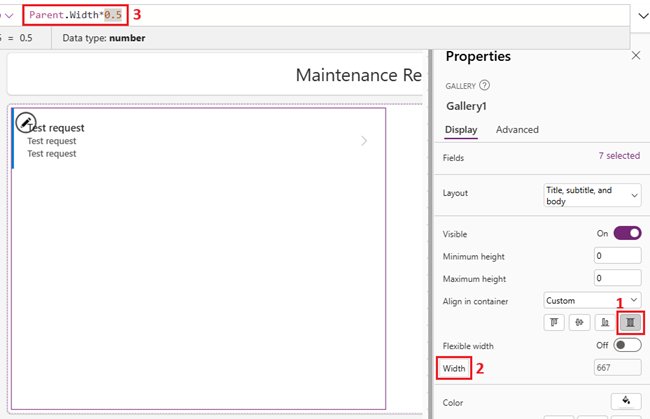

12. Select main container from tree view and add **Edit form**.

    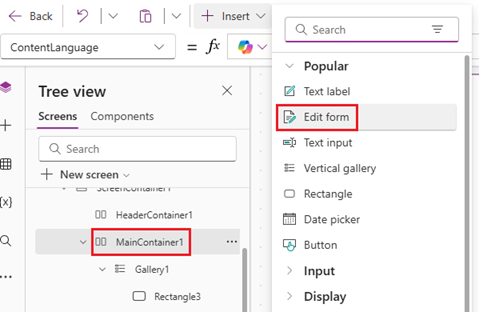
13. Select **Data** and choose **Maintenance Requests**.

    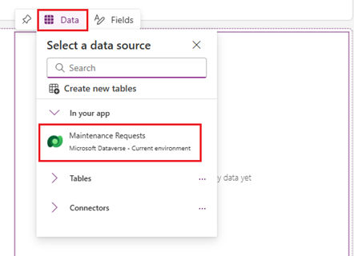
14. Remove all the other fields **except**: `Title`, `Description`, `Priority`,
    `Location`.

    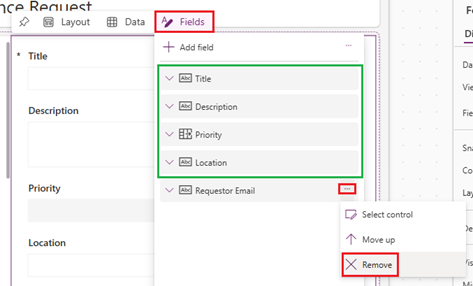
15. Set form properties:
    - Columns: **1**
    - Default mode: **New**
    - Item: **Gallery1.Selected**

    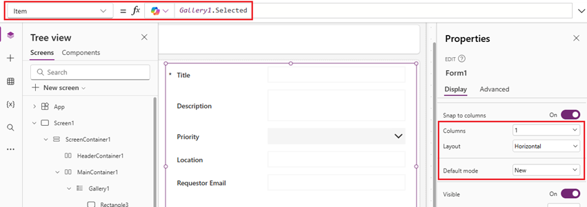
16. Click **+** in the footer container (FooterContainer1) and add **Button**
    control.

    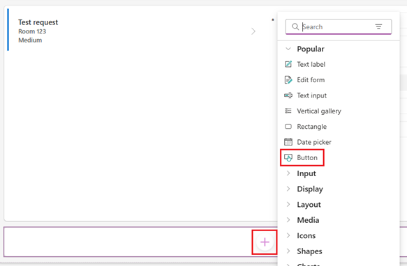
17. Configure button like below:
    - Text: **Submit**
    - OnSelect:
      ```powerfx
      SubmitForm(Form1)
      ```

    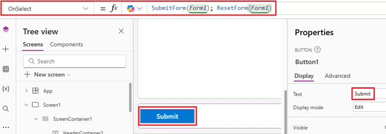
18. Lets add another button to footer. Make sure that footer container is selected
    and add new **Button**.

    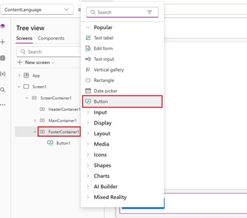
19. Configure Clear button:
    - Text: **Clear**
    - OnSelect:
      ```powerfx
      ResetForm(Form1)
      ```

    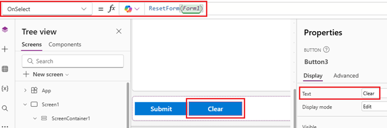

> 💡 **Responsive tips:** Use **layout containers** instead of absolute
> positioning; size controls relative to `Parent.Width`/`Parent.Height`; and
> preview at different sizes with the browser dev tools device toolbar (F12) to
> confirm the layout reflows.

✅ **Checkpoint:** You can add a record with the form and see it in the gallery,
and the layout reflows when you resize the window.

---

## Part 4 — Call the flow from the app (~5 min)

1. Click three dots from the main left menu and select **Power Automate**.

   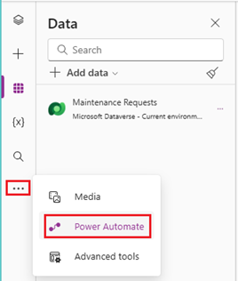
2. Click **+ Add flow** and select **Notify Maintenance Request**.

   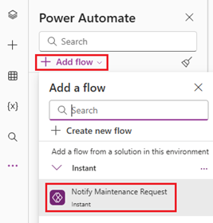
3. Select the **Submit** button, then set its **OnSelect** to submit the form and
   call the flow with the form values:
   ```powerfx
   SubmitForm(Form1);
   NotifyMaintenanceRequest.Run(
       Form1.Updates.Title,
       Form1.Updates.'Requestor Email',
       Form1.Updates.Priority.Value
   );
   Notify("Request submitted and notification sent!", NotificationType.Success)
   ```
   > If a field name contains a space, wrap it in single quotes as shown.
   > If your flow returns an output, you can capture it:
   > `Set(varResult, NotifyMaintenanceRequest.Run(...).result)`.
4. **Save** (Ctrl+S) and then **Preview** the app (F5 / ▶ Play).

✅ **Checkpoint:** Submitting the form creates a Dataverse row **and** triggers the
flow, which sends the confirmation email.

---

## Test end-to-end

1. In Preview, fill the form: Title = `Broken AC`, Location = `Bldg 3 / Rm 210`,
   Priority = `High`, Requestor Email = *your email*.
2. Select **Submit** → the success banner appears.
3. Confirm the new record shows in the gallery.
4. Check your inbox for the `Request received: Broken AC` email.
5. In Power Automate → **My flows** → `Notify Maintenance Request` →
   **Run history** to confirm a successful run.

---

## Troubleshooting

- **Flow not listed in the app:** Ensure the flow's trigger is
  *When Power Apps calls a flow (V2)* and it's **saved**; refresh the app.
- **`.Value` errors on Priority/Status:** Choice columns return a record —
  use `.Value` (e.g., `ThisItem.Priority.Value`,
  `Form1.Updates.Priority.Value`).
- **No email received:** Verify the Office 365 Outlook connection is authorized;
  check the flow **Run history** for errors; look in Junk.
- **Form field names with spaces:** Reference them with single quotes,
  e.g., `Form1.Updates.'Requestor Email'`.
- **Permission errors:** Confirm you're in the correct environment and have
  maker/creator rights.

---

## What you learned

- Creating a **custom Dataverse table** with typed and choice columns.
- Building a **responsive Canvas app** (Responsive layout + layout containers)
  that reads (gallery) and writes (edit form) Dataverse data.
- Authoring an **instant Power Automate cloud flow** with PowerApps (V2) inputs.
- **Calling the flow from Power Fx** using `<FlowName>.Run(...)` and passing form values.

## Stretch goals (optional)

- Return a value from the flow and display it with a label.
- Add a **Status** update screen using a second form (`FormMode.Edit`).
- Replace the email action with a **Teams** "Post message" action.
- Add search/filter to the gallery:
  `Filter(Search('Maintenance Requests', TextInput1.Text, "cr_title"), Status.Value = "New")`.
