# Lab: Build a Canvas Power App with a Dataverse Table and a Power Automate Flow

**Duration:** ~30 minutes (40 with the optional approvals part)
**Level:** Beginner
**Product area:** Microsoft Power Platform (Power Apps, Dataverse, Power Automate)

## Scenario

You work for **Contoso**, and the facilities team needs a quick way to log
maintenance requests. In this lab you will:

1. Create a custom **Dataverse** table to store requests.
2. Build a **Canvas Power App** to add and view requests.
3. Create a **Power Automate cloud flow** and call it from the app to send a
   confirmation notification.
4. *(Optional)* Add an **approval** so a manager approves each request and the
   record's **Status** updates automatically based on the decision.

## Prerequisites

- Access to a Power Platform **environment** with **Dataverse** provisioned
  (a Developer environment works — https://make.powerapps.com).
- A license or trial that includes Power Apps and Power Automate.
- A modern browser (Edge/Chrome).
- ~30 minutes (≈40 with the optional Part 5).
- For the optional Part 5 (approvals), the **Approvals** connector (included with
  most Microsoft 365 plans).

> Tip: If you don't have an environment, sign up for the free
> **Power Apps Developer Plan** at https://powerapps.microsoft.com/developerplan/.

## About the screenshots

The images in this lab (under [`images/`](images/)) are **placeholders**. Each is
labeled with the part and step it belongs to. To use your own captures:

1. Take a screenshot of the step in the maker portal.
2. Save it into the `images/` folder, **overwriting the matching filename**
   (e.g., `images/P1-new-table.png`) — keep the same name and the doc updates
   automatically, no Markdown edits needed.
3. Recommended: **1200×675** (16:9) PNG, and crop out any personal/tenant
   details before publishing publicly.

> ⚠️ **Before publishing to a public GitHub repo:** make sure screenshots don't
> expose tenant names, email addresses, environment URLs, or other private data.

| Image | Step |
|-------|------|
| `P1-new-table.png` | Part 1 – Tables › New table |
| `P1-table-columns.png` | Part 1 – Table columns |
| `P1-new-column.png` | Part 1 – Opening the New column panel |
| `sync-global-choice.png` | Part 1 – Choice: Sync with global choice = No |
| `P2-new-instant-flow.png` | Part 2 – Create instant cloud flow |
| `P2-new-instant-flow-2.png` | Part 2 – Name flow + choose trigger |
| `P2-flow-trigger-inputs.png` | Part 2 – PowerApps (V2) trigger inputs |
| `P2-new-action.png` | Part 2 – Add a new action |
| `P2-send-an-email-action.png` | Part 2 – Search Send an email action |
| `P2-outlook-connection.png` | Part 2 – Sign in to create the connection |
| `P2-sendanemail-rename.png` | Part 2 – Rename action to SendEmail |
| `P2-sendanemail-dynamic-content.png` | Part 2 – Enable Dynamic content for To |
| `P2-sendanemail-to.png` | Part 2 – Select RequestorEmail for To |
| `P2-sendanemail-subject.png` | Part 2 – Subject with dynamic content |
| `P2-sendanemail-priority.png` | Part 2 – Priority dynamic content in Body |
| `P2-respond-to-app.png` | Part 2 – Respond to a PowerApp or flow |
| `P2-respond-to-app-2.png` | Part 2 – Return Result output |
| `P2-respond-to-app-3.png` | Part 2 – Add SendEmail status expression |
| `P2-save-flow.png` | Part 2 – Save the flow |
| `P4-create-app.png` | Part 3 – Create from blank |
| `P4-responsive-app.png` | Part 3 – Select Responsive |
| `P4-add-header.png` | Part 3 – Add Text label to header |
| `P4-header-conf.png` | Part 3 – Configure header label |
| `P4-add-data.png` | Part 3 – Add Dataverse data source |
| `P4-add-gallery.png` | Part 3 – Add vertical gallery |
| `P4-select-gallery-data.png` | Part 3 – Select gallery data source |
| `06-gallery.png` | Part 3 – Vertical gallery |
| `07-edit-form.png` | Part 3 – Edit form + Submit |
| `08-add-flow-to-app.png` | Part 4 – Add flow to app |
| `09-button-onselect.png` | Part 4 – Button OnSelect (Power Fx) |
| `10-test-email.png` | Test – Confirmation email + run history |
| `11-approval-action.png` | Part 5 – Start and wait for an approval |
| `12-approval-condition.png` | Part 5 – Condition on Outcome + update Status |

---

## Part 1 — Create the Dataverse table (~7 min)

1. Go to **https://make.powerapps.com** and confirm your environment
   (top-right environment picker).
2. In the left nav, select **Tables** → **+ New table** →
   **Table (advanced properties)** (this opens the properties panel where you can
   set the display name).

   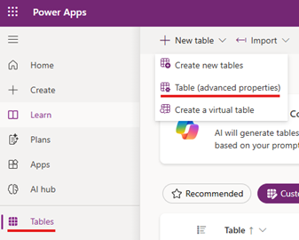

3. In the properties panel enter:
   - **Display name:** `Maintenance Request`
   - Plural name auto-fills to `Maintenance Requests`.
4. Select **Save**. Dataverse creates the table with a primary column
   **Name** (rename its display name to `Title` via the column settings if you like).
5. Select the **+** next to the columns list to open the **New column** panel.

   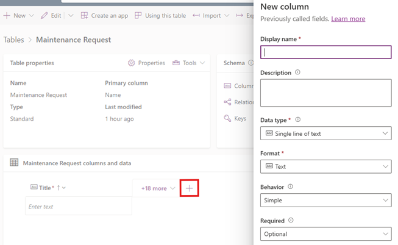

6. Add these columns by defining **Display name**, **Data type**, and **Format**.

   | Display name  | Data type            | Notes                                            |
   |---------------|----------------------|--------------------------------------------------|
   | `Description` | Multiline text       | Details of the issue                             |
   | `Location`    | Single line of text  | Building / room                                  |
   | `Priority`    | Choice               | Choices: `Low`, `Medium`, `High`                 |
   | `Status`      | Choice               | Choices: `New`, `In Progress`, `Done` (default `New`) |
   | `Requestor Email` | Single line of text (Email format) | Who logged it                       |

   > [!CAUTION]
   > **Choice columns:** For `Priority` and `Status`, when the **New column**
   > panel asks **Sync with global choice?**, set it to **No** so you create a
   > local choice with your own options for this table.

   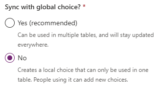

7. Your table should now look like this. *(Optional)* Add a couple of sample rows
   via **Edit** → **+ New row**.

   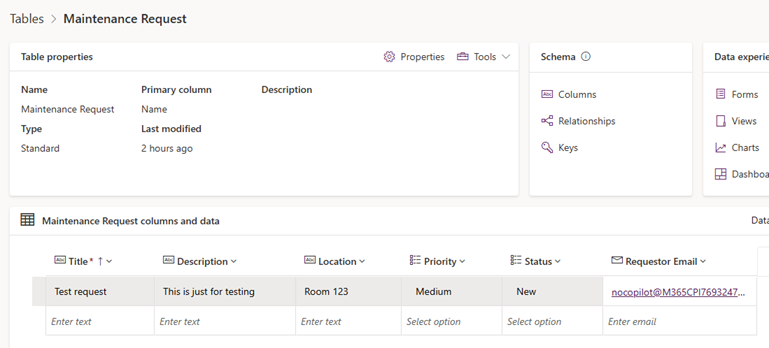

✅ **Checkpoint:** You have a `Maintenance Request` table with custom columns.

---

## Part 2 — Create the Power Automate cloud flow (~8 min)

You'll build the flow first so the app can call it.

1. Go to **https://make.powerautomate.com** (same environment).
2. Select **Create** → **Instant cloud flow**.

   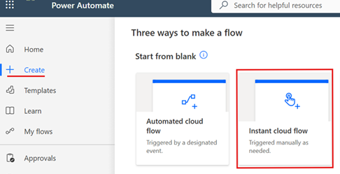

3. Name it `Notify Maintenance Request`, choose **When Power Apps calls a flow
   (V2)** and then click **Create**.

   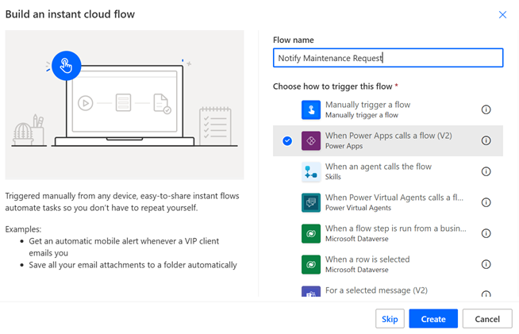

4. On the **PowerApps (V2)** trigger, select **+ Add an input**:
   - Add a **Text** input named `RequestTitle`.
   - Add a **Text** input named `RequestorEmail`.
   - Add a **Text** input named `Priority`.

   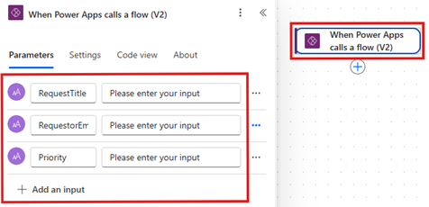

5. Select **+ New action**.

   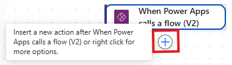

6. Search for send an email and select **Office 365 Outlook** > **Send an email
   (V2)** action.

   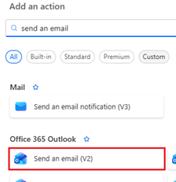

7. Select **Sign in** to create the connection.

   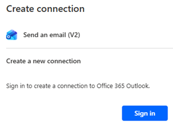

8. Configure **Send an email (V2)** action like below:
   - Rename the action as `SendEmail`.

     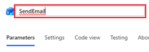
   - Enable Dynamic content for the **To** field.

     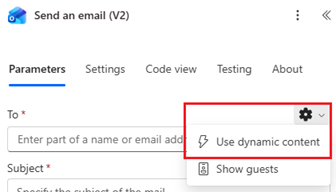
   - **To:** click lightning icon and select `RequestorEmail`.

     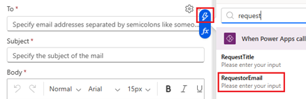
   - **Subject:** `Request received: ` then insert dynamic content `RequestTitle`.

     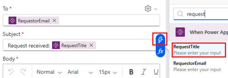
   - **Body:** Copy following text to it and use the **Dynamic content** picker
     to insert **RequestTitle** and **Priority** instead of typing the tokens.
     ```
     Your maintenance request "@{triggerBody()['text']}" was logged.
     Priority: (insert Priority dynamic content)
     We'll follow up shortly. — Contoso Facilities
     ```

     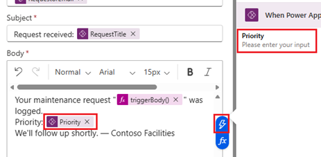
9. Add **+ New step** → **Respond to a PowerApp or flow**.

   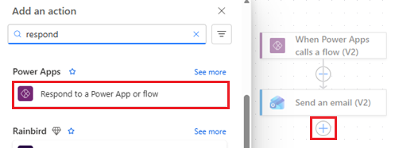
10. Add output (Text) with name `Result`, then click the value field and select
    expression.

    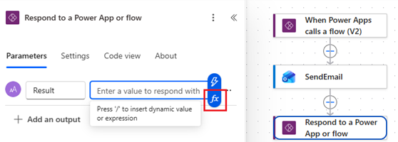
11. Type or copy-paste this expression to the field and click **Add**:

    ```
    actions('SendEmail').status
    ```

    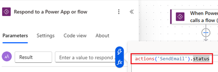
12. **Save** the flow.

   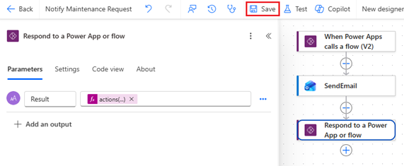

✅ **Checkpoint:** A flow named `Notify Maintenance Request` accepts 3 inputs and
sends an email.

---

## Part 3 — Build the Canvas app (responsive) (~10 min)

1. Back in **https://make.powerapps.com/**, select **+ Create** → **Create from
   blank**.

   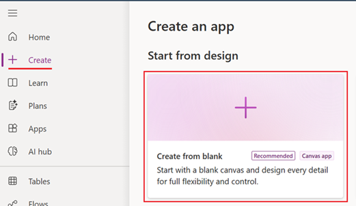
2. Select **Responsive**.

   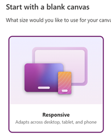

3. Click **+** in header area and select **Text label**.

   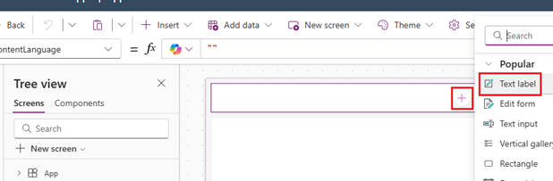
4. Configure control in properties pane like below:
   - Text: `Maintenance Request`
   - Font: 24
   - Text alignment: Center
   - Auto height: On
   - Flexible width: On

   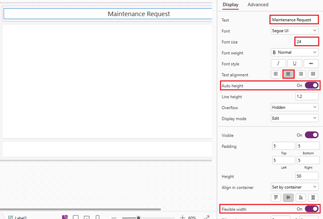
5. **Connect the data:** left rail **Data** → **+ Add data** → search/select
   `Maintenance Request`.

   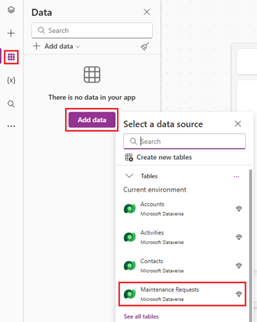

6. Click **+** in the main area (main container) and add **Vertical gallery** control.

   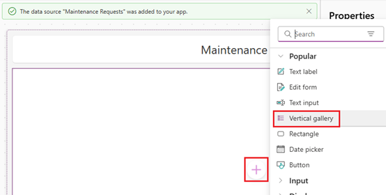
7. Click **Data** and select **Maintenance Requests**.

   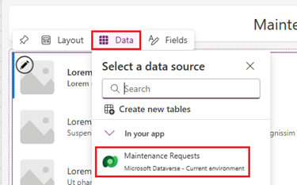
   - Set the gallery **Layout** to *Title, subtitle, and body* and map:
     - Title → `Title`
     - Subtitle → `Location`
     - Body → `Priority` (choice → use `.Value` if needed:
       `ThisItem.Priority.Value`).
   - For responsiveness, avoid fixed X/Y — let the container position it, and set
     **Width**/**Height** with `Parent.Width` / `Parent.Height` fractions
     (e.g. `Parent.Width * 0.4`).

   

8. **Add an input form (create records):**
   - **Insert** → **Edit form** (place it inside the container) → data source
     `Maintenance Requests`.
   - In the form's **Fields**, add: `Title`, `Description`, `Location`,
     `Priority`, `Requestor Email`.
   - Set the form **DefaultMode** to `FormMode.New`.
   - Set the form **Width** to fill the remaining container space
     (e.g. `Parent.Width * 0.6`).
9. **Add a Submit button:**
   - **Insert** → **Button**, label it `Submit`.
   - Set its **OnSelect** to:
     ```powerfx
     SubmitForm(Form1)
     ```
     (replace `Form1` with your form's name).

   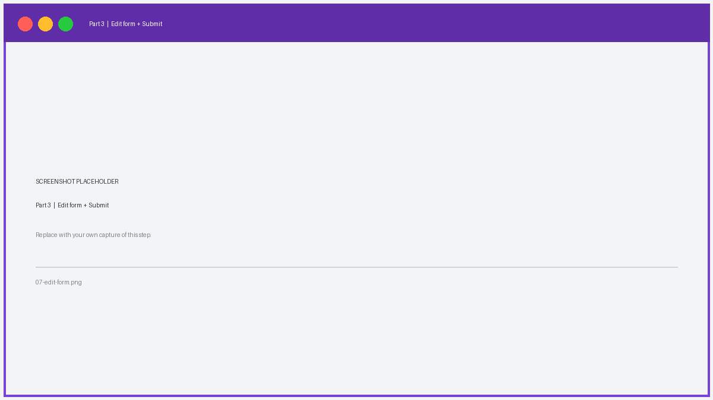

> 💡 **Responsive tips:** Use **layout containers** instead of absolute
> positioning; size controls relative to `Parent.Width`/`Parent.Height`; and
> preview at different sizes with the browser dev tools device toolbar (F12) to
> confirm the layout reflows.

✅ **Checkpoint:** You can add a record with the form and see it in the gallery,
and the layout reflows when you resize the window.

---

## Part 4 — Call the flow from the app (~5 min)

1. Select the **Submit** button (or add a second button `Submit & Notify`).
2. With the button selected, go to the **Power Automate** pane
   (left rail ⋯ **More** → **Power Automate**) → **+ Add flow** →
   choose `Notify Maintenance Request`.
   Adding it makes the flow available as `NotifyMaintenanceRequest.Run(...)`.

   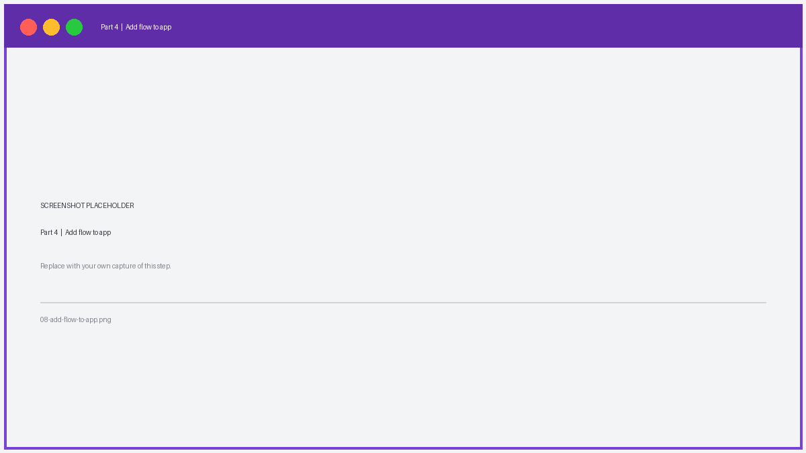

3. Set the button **OnSelect** to submit the form, then call the flow with the
   form values:
   ```powerfx
   SubmitForm(Form1);
   NotifyMaintenanceRequest.Run(
       Form1.Updates.Title,
       Form1.Updates.'Requestor Email',
       Form1.Updates.Priority.Value
   );
   Notify("Request submitted and notification sent!", NotificationType.Success)
   ```
   > If a field name contains a space, wrap it in single quotes as shown.
   > If your flow returns an output, you can capture it:
   > `Set(varResult, NotifyMaintenanceRequest.Run(...).result)`.
4. **Save** (Ctrl+S) and then **Preview** the app (F5 / ▶ Play).

   

✅ **Checkpoint:** Submitting the form creates a Dataverse row **and** triggers the
flow, which sends the confirmation email.

---

## Part 5 — Add an approval (optional, ~10 min)

> **Optional.** Skip this part if you only have 30 minutes — Parts 1–4 are a
> complete, working app. Do this part to take the lab to ~40 minutes and learn
> approvals.

Now extend the flow so a manager approves each request, and the Dataverse
**Status** updates automatically based on the decision.

1. Open the flow **`Notify Maintenance Request`** in
   **https://make.powerautomate.com** → **Edit**.
2. After the trigger (and before or after the email step), select **+ New step**
   → search **Approvals** → choose **Start and wait for an approval**.
   - **Approval type:** `Approve/Reject – First to respond`.
   - **Title:** `Maintenance request: ` + dynamic content `RequestTitle`.
   - **Assigned to:** your own email (so you can approve it in this lab) — in
     real life this would be the facilities manager.
   - **Details:** add `Priority: ` + dynamic content `Priority`.

   

3. Add **+ New step** → **Condition**. Set it to:
   `Outcome` (dynamic content from the approval) **is equal to** `Approve`.
4. Configure the two branches:
   - **If yes** → **Add an action** → **Microsoft Dataverse → Update a row**.
     - **Table name:** `Maintenance Requests`.
     - **Row ID:** dynamic content for the created row's ID. *(If your flow only
       had the PowerApps trigger, first add a Dataverse **Add a row** step at the
       top that creates the record and returns its ID — see the note below.)*
     - **Status:** `In Progress`.
   - **If no** → **Update a row** the same way, but set **Status** to a rejected
     value (reuse `New`, or add a `Rejected` choice to the table).

   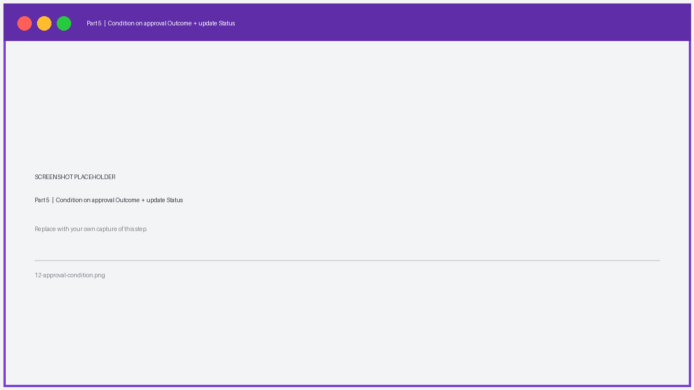

5. *(Optional)* In each branch add a **Send an email (V2)** action to tell the
   requestor the outcome.
6. **Save** the flow and **Test** → **Manually**, or trigger it from the app.

> **Note — where the row comes from:** In Parts 3–4 the **app** creates the
> Dataverse row (via `SubmitForm`) and then calls the flow. For the flow to
> update *that* row, pass the new record's ID from the app into the flow:
> add a **Text** input `RecordID` to the trigger, then in the button call use
> `NotifyMaintenanceRequest.Run(Form1.LastSubmit.Title, ..., Form1.LastSubmit.'Maintenance Request')`
> to pass `Form1.LastSubmit.<primary-id>`. Alternatively, let the **flow** create
> the row with a **Dataverse → Add a row** step and use its returned **Row ID**
> in the Update actions.

✅ **Checkpoint:** The request now routes through an approval, and the row's
**Status** becomes `In Progress` when approved.

---

## Test end-to-end

1. In Preview, fill the form: Title = `Broken AC`, Location = `Bldg 3 / Rm 210`,
   Priority = `High`, Requestor Email = *your email*.
2. Select **Submit** → the success banner appears.
3. Confirm the new record shows in the gallery.
4. Check your inbox for the `Request received: Broken AC` email.
5. In Power Automate → **My flows** → `Notify Maintenance Request` →
   **Run history** to confirm a successful run.
6. *(Optional — only if you did Part 5)* **Approve the request:** open the
   approval from the email, the **Approvals** app in Teams, or **Power Automate →
   Approvals → Received**, and select **Approve**. Confirm the record's
   **Status** changed to `In Progress` in the app gallery (or in the table's data
   view).


---

## Troubleshooting

- **Flow not listed in the app:** Ensure the flow's trigger is
  *When Power Apps calls a flow (V2)* and it's **saved**; refresh the app.
- **`.Value` errors on Priority/Status:** Choice columns return a record —
  use `.Value` (e.g., `ThisItem.Priority.Value`,
  `Form1.Updates.Priority.Value`).
- **No email received:** Verify the Office 365 Outlook connection is authorized;
  check the flow **Run history** for errors; look in Junk.
- **Form field names with spaces:** Reference them with single quotes,
  e.g., `Form1.Updates.'Requestor Email'`.
- **Permission errors:** Confirm you're in the correct environment and have
  maker/creator rights.
- **Approval never arrives:** Check the flow **Run history** at the *Start and
  wait for an approval* step; ensure **Assigned to** is a valid user; look in the
  **Approvals** app in Teams and in email (including Junk).
- **Status doesn't update after approval:** Verify the **Update a row** action
  has the correct **Row ID** (the created record's primary ID) and that the
  **Status** choice value matches a real option on the table.

---

## What you learned

- Creating a **custom Dataverse table** with typed and choice columns.
- Building a **responsive Canvas app** (Responsive layout + layout containers)
  that reads (gallery) and writes (edit form) Dataverse data.
- Authoring an **instant Power Automate cloud flow** with PowerApps (V2) inputs.
- **Calling the flow from Power Fx** using `<FlowName>.Run(...)` and passing form values.
- Adding an **approval** with *Start and wait for an approval*, branching on the
  **Outcome**, and updating a Dataverse row's **Status** automatically.

## Stretch goals (optional)

- Return a value from the flow and display it with a label.
- Add a **Status** update screen using a second form (`FormMode.Edit`).
- Replace the email action with a **Teams** "Post message" action.
- Add search/filter to the gallery:
  `Filter(Search('Maintenance Requests', TextInput1.Text, "cr_title"), Status.Value = "New")`.
