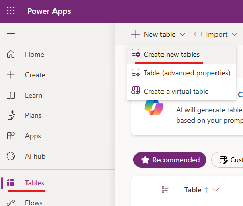
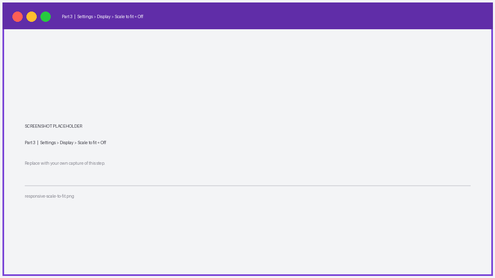
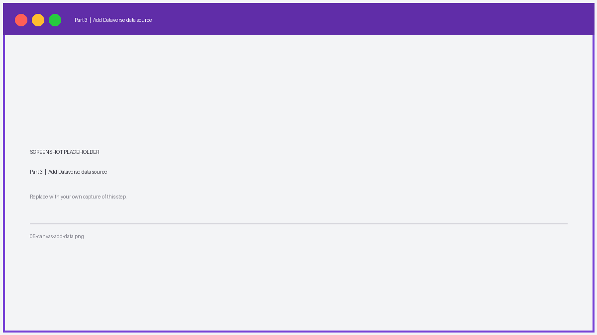

# Lab: Build a Canvas Power App with a Dataverse Table and a Power Automate Flow

**Duration:** ~30 minutes
**Level:** Beginner
**Product area:** Microsoft Power Platform (Power Apps, Dataverse, Power Automate)

## Scenario

You work for **Contoso**, and the facilities team needs a quick way to log
maintenance requests. In this lab you will:

1. Create a custom **Dataverse** table to store requests.
2. Build a **Canvas Power App** to add and view requests.
3. Create a **Power Automate cloud flow** and call it from the app to send a
   confirmation notification.

## Prerequisites

- Access to a Power Platform **environment** with **Dataverse** provisioned
  (a Developer environment works — https://make.powerapps.com).
- A license or trial that includes Power Apps and Power Automate.
- A modern browser (Edge/Chrome).
- ~30 minutes.

> Tip: If you don't have an environment, sign up for the free
> **Power Apps Developer Plan** at https://powerapps.microsoft.com/developerplan/.

## About the screenshots

The images in this lab (under [`images/`](images/)) are **placeholders**. Each is
labeled with the part and step it belongs to. To use your own captures:

1. Take a screenshot of the step in the maker portal.
2. Save it into the `images/` folder, **overwriting the matching filename**
   (e.g., `images/01-new-table.png`) — keep the same name and the doc updates
   automatically, no Markdown edits needed.
3. Recommended: **1200×675** (16:9) PNG, and crop out any personal/tenant
   details before publishing publicly.

> ⚠️ **Before publishing to a public GitHub repo:** make sure screenshots don't
> expose tenant names, email addresses, environment URLs, or other private data.

| Image | Step |
|-------|------|
| `01-new-table.png` | Part 1 – Tables › New table |
| `02-table-columns.png` | Part 1 – Table columns |
| `03-flow-trigger-inputs.png` | Part 2 – PowerApps (V2) trigger inputs |
| `04-flow-send-email.png` | Part 2 – Send an email (V2) |
| `responsive-scale-to-fit.png` | Part 3 – Settings › Display › Scale to fit Off |
| `05-canvas-add-data.png` | Part 3 – Add Dataverse data source |
| `06-gallery.png` | Part 3 – Vertical gallery |
| `07-edit-form.png` | Part 3 – Edit form + Submit |
| `08-add-flow-to-app.png` | Part 4 – Add flow to app |
| `09-button-onselect.png` | Part 4 – Button OnSelect (Power Fx) |
| `10-test-email.png` | Test – Confirmation email + run history |

---

## Part 1 — Create the Dataverse table (~7 min)

1. Go to **https://make.powerapps.com** and confirm your environment
   (top-right environment picker).
2. In the left nav, select **Tables** → **+ New table** → **New table**.

   
   *Tables → + New table → New table.*

3. In the properties panel enter:
   - **Display name:** `Maintenance Request`
   - Plural name auto-fills to `Maintenance Requests`.
4. Select **Save**. Dataverse creates the table with a primary column
   **Name** (rename its display name to `Title` via the column settings if you like).
5. Add these columns using **+ New column** (in the table designer or the columns view):

   | Display name  | Data type            | Notes                                            |
   |---------------|----------------------|--------------------------------------------------|
   | `Description` | Multiline text       | Details of the issue                             |
   | `Location`    | Single line of text  | Building / room                                  |
   | `Priority`    | Choice               | Choices: `Low`, `Medium`, `High`                 |
   | `Status`      | Choice               | Choices: `New`, `In Progress`, `Done` (default `New`) |
   | `Requestor Email` | Single line of text (Email format) | Who logged it                       |

6. **Save** the table. Leave the designer open (optional: add 1–2 sample rows
   via **Edit** → **+ New row**).

   
   *The Maintenance Request table showing the custom columns.*

✅ **Checkpoint:** You have a `Maintenance Request` table with custom columns.

---

## Part 2 — Create the Power Automate cloud flow (~8 min)

You'll build the flow first so the app can call it.

1. Go to **https://make.powerautomate.com** (same environment).
2. Select **Create** → **Instant cloud flow**.
3. Name it `Notify Maintenance Request`.
4. Choose the trigger **When Power Apps calls a flow (V2)** → **Create**.
5. On the **PowerApps (V2)** trigger, select **+ Add an input**:
   - Add a **Text** input named `RequestTitle`.
   - Add a **Text** input named `RequestorEmail`.
   - Add a **Text** input named `Priority`.

   
   *The PowerApps (V2) trigger with RequestTitle, RequestorEmail, and Priority inputs.*

6. Select **+ New step** → search **Office 365 Outlook** → action
   **Send an email (V2)** (or use **Send me an email notification** if you
   prefer no connector setup).
   - **To:** click the field → **Dynamic content** → `RequestorEmail`.
   - **Subject:** `Request received: ` then insert dynamic content `RequestTitle`.
   - **Body:**
     ```
     Your maintenance request "@{triggerBody()['text']}" was logged.
     Priority: (insert Priority dynamic content)
     We'll follow up shortly. — Contoso Facilities
     ```
     (Use the **Dynamic content** picker to insert `RequestTitle` and `Priority`
     instead of typing the tokens.)
7. *(Optional)* Add **+ New step** → **Respond to a PowerApp or flow** and return
   an output `Result` (Text) = `Sent`. This lets the app read a response.
8. **Save** the flow.

   
   *Send an email (V2) with dynamic content from the trigger inputs.*

✅ **Checkpoint:** A flow named `Notify Maintenance Request` accepts 3 inputs and
sends an email.

---

## Part 3 — Build the Canvas app (responsive) (~10 min)

1. Back in **https://make.powerapps.com**, select **+ Create** →
   **Blank app** → **Blank canvas app** → **Create**.
   Name it `Maintenance Requests`. (You can pick either format here — you'll
   switch it to responsive in the next step.)
2. **Turn on responsive layout:** go to **Settings** (gear ⚙️ top-right) →
   **Display**, then:
   - Turn **Scale to fit** **Off** (this also turns off *Lock aspect ratio*).
   - Leave **Orientation** as you like.
   - **Save**. The screen now resizes to fill the browser/device.

   
   *Settings → Display → Scale to fit = Off (this makes the app responsive).*

3. **Make the screen fluid:** select the **Screen**, set **Width** to
   `Max(App.Width, App.MinScreenWidth)` and **Height** to
   `Max(App.Height, App.MinScreenHeight)` so controls have the full viewport to
   respond to. *(Optional but recommended for true responsiveness.)*
4. **Add a responsive container:** **Insert** → **Layout** →
   **Horizontal container** (or **Vertical container**). Set the container's
   **Width** = `Parent.Width` and **Height** = `Parent.Height`. Place your
   gallery and form **inside** this container — containers auto-distribute space
   as the window resizes, which is the key to a responsive app.
5. **Connect the data:** left rail **Data** → **+ Add data** → search
   `Maintenance Request` → add the table.

   
   *Data → + Add data → Maintenance Request.*

6. **Add a gallery (view records):**
   - **Insert** → **Vertical gallery** (place it inside the container) → choose
     the `Maintenance Requests` data source.
   - Set the gallery **Layout** to *Title, subtitle, and body* and map:
     - Title → `Title`
     - Subtitle → `Location`
     - Body → `Priority` (choice → use `.Value` if needed:
       `ThisItem.Priority.Value`).
   - For responsiveness, avoid fixed X/Y — let the container position it, and set
     **Width**/**Height** with `Parent.Width` / `Parent.Height` fractions
     (e.g. `Parent.Width * 0.4`).

   
   *A vertical gallery showing Title, Location, and Priority.*

7. **Add an input form (create records):**
   - **Insert** → **Edit form** (place it inside the container) → data source
     `Maintenance Requests`.
   - In the form's **Fields**, add: `Title`, `Description`, `Location`,
     `Priority`, `Requestor Email`.
   - Set the form **DefaultMode** to `FormMode.New`.
   - Set the form **Width** to fill the remaining container space
     (e.g. `Parent.Width * 0.6`).
8. **Add a Submit button:**
   - **Insert** → **Button**, label it `Submit`.
   - Set its **OnSelect** to:
     ```powerfx
     SubmitForm(Form1)
     ```
     (replace `Form1` with your form's name).

   
   *An edit form (FormMode.New) with a Submit button.*

> 💡 **Responsive tips:** Use **layout containers** instead of absolute
> positioning; size controls relative to `Parent.Width`/`Parent.Height`; and
> preview at different sizes with the browser dev tools device toolbar (F12) to
> confirm the layout reflows.

✅ **Checkpoint:** You can add a record with the form and see it in the gallery,
and the layout reflows when you resize the window.

---

## Part 4 — Call the flow from the app (~5 min)

1. Select the **Submit** button (or add a second button `Submit & Notify`).
2. With the button selected, go to the **Power Automate** pane
   (left rail ⋯ **More** → **Power Automate**) → **+ Add flow** →
   choose `Notify Maintenance Request`.
   Adding it makes the flow available as `NotifyMaintenanceRequest.Run(...)`.

   
   *Power Automate pane → + Add flow → Notify Maintenance Request.*

3. Set the button **OnSelect** to submit the form, then call the flow with the
   form values:
   ```powerfx
   SubmitForm(Form1);
   NotifyMaintenanceRequest.Run(
       Form1.Updates.Title,
       Form1.Updates.'Requestor Email',
       Form1.Updates.Priority.Value
   );
   Notify("Request submitted and notification sent!", NotificationType.Success)
   ```
   > If a field name contains a space, wrap it in single quotes as shown.
   > If your flow returns an output, you can capture it:
   > `Set(varResult, NotifyMaintenanceRequest.Run(...).result)`.
4. **Save** (Ctrl+S) and then **Preview** the app (F5 / ▶ Play).

   
   *The Submit button's OnSelect: SubmitForm + flow.Run(...) + Notify.*

✅ **Checkpoint:** Submitting the form creates a Dataverse row **and** triggers the
flow, which sends the confirmation email.

---

## Test end-to-end

1. In Preview, fill the form: Title = `Broken AC`, Location = `Bldg 3 / Rm 210`,
   Priority = `High`, Requestor Email = *your email*.
2. Select **Submit** → the success banner appears.
3. Confirm the new record shows in the gallery.
4. Check your inbox for the `Request received: Broken AC` email.
5. In Power Automate → **My flows** → `Notify Maintenance Request` →
   **Run history** to confirm a successful run.


*The confirmation email plus a successful run in the flow's run history.*

---

## Troubleshooting

- **Flow not listed in the app:** Ensure the flow's trigger is
  *When Power Apps calls a flow (V2)* and it's **saved**; refresh the app.
- **`.Value` errors on Priority/Status:** Choice columns return a record —
  use `.Value` (e.g., `ThisItem.Priority.Value`,
  `Form1.Updates.Priority.Value`).
- **No email received:** Verify the Office 365 Outlook connection is authorized;
  check the flow **Run history** for errors; look in Junk.
- **Form field names with spaces:** Reference them with single quotes,
  e.g., `Form1.Updates.'Requestor Email'`.
- **Permission errors:** Confirm you're in the correct environment and have
  maker/creator rights.

---

## What you learned

- Creating a **custom Dataverse table** with typed and choice columns.
- Building a **responsive Canvas app** (Scale to fit off + layout containers)
  that reads (gallery) and writes (edit form) Dataverse data.
- Authoring an **instant Power Automate cloud flow** with PowerApps (V2) inputs.
- **Calling the flow from Power Fx** using `<FlowName>.Run(...)` and passing form values.

## Stretch goals (optional)

- Return a value from the flow and display it with a label.
- Add a **Status** update screen using a second form (`FormMode.Edit`).
- Replace the email action with a **Teams** "Post message" action.
- Add search/filter to the gallery:
  `Filter(Search('Maintenance Requests', TextInput1.Text, "cr_title"), Status.Value = "New")`.
